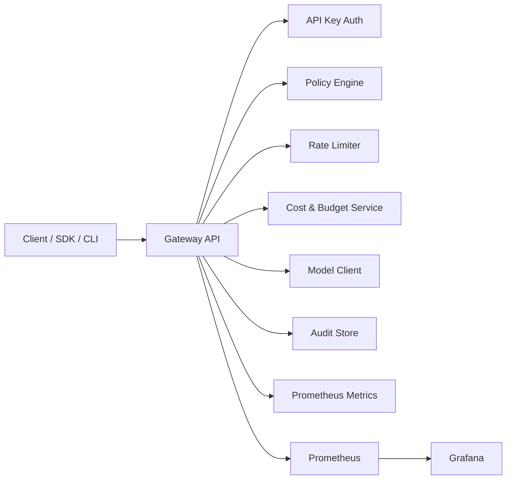

# llm-gateway-control-plane

[](https://github.com/WaiperOK/llm-gateway-control-plane/actions/workflows/ci.yml)
[](https://github.com/WaiperOK/llm-gateway-control-plane/releases)

Enterprise-style LLM gateway with safety policy enforcement, tenant quotas, cost control, audit logging, and Prometheus observability.

## Why this project

This repository demonstrates control-plane engineering patterns required in production AI systems:

- tenant auth and authorization (API key + model allowlist)
- policy engine with deny decisions for unsafe prompt patterns
- per-team rate limiting (RPM)
- budget-aware cost accounting
- redacted audit logs for compliance workflows
- metrics for requests, latency, tokens, and estimated cost

## Architecture



Detailed design: `docs/ARCHITECTURE.md`.

## Quick start (2 minutes)

### 1) Run locally

```bash
make run
```

### 2) Send a completion request

```bash
curl -sS http://localhost:8080/v1/gateway/completions \
  -H "Content-Type: application/json" \
  -H "X-API-Key: demo-red-key" \
  -d '{"model":"gpt-4o-mini","input":"Investigate suspicious login burst for john@example.com"}' | jq
```

### 3) Check usage and audit

```bash
curl -sS http://localhost:8080/v1/teams/me/usage -H "X-API-Key: demo-red-key" | jq
curl -sS "http://localhost:8080/v1/audit?limit=10" -H "X-API-Key: demo-red-key" | jq
```

## Docker Compose stack

```bash
make docker-up
```

Services:

- gateway: `http://localhost:8080`
- Prometheus: `http://localhost:9090`
- Grafana: `http://localhost:3000` (admin/admin)

## API surface

### `POST /v1/gateway/completions`

Request:

```json
{
  "model": "gpt-4o-mini",
  "input": "Analyze this incident timeline and suggest next triage actions"
}
```

Response:

```json
{
  "request_id": "req-2f1a6cc5d0d6f5c1",
  "team": "red-team",
  "model": "gpt-4o-mini",
  "output": "[gpt-4o-mini] triage summary: ...",
  "input_tokens": 19,
  "output_tokens": 37,
  "cost_usd": 0.000168,
  "policy_decision": "allow",
  "processed_at": "2026-02-11T15:43:00Z"
}
```

### `GET /v1/teams/me/usage`

Returns request count, tokens, total/remaining budget, and cost by model.

### `GET /v1/audit?limit=50`

Returns redacted audit events for the authenticated team.

### `GET /metrics`

Prometheus metrics.

## Security and trust

- Security policy and reporting: `SECURITY.md`
- Threat model: `docs/THREAT_MODEL.md`
- Architecture decision records: `docs/adr/`

## Development

```bash
make fmt
make lint
make test
make integration
```

## Release

Initial baseline target: `v0.1.0`.

See roadmap in `docs/ROADMAP.md`.
